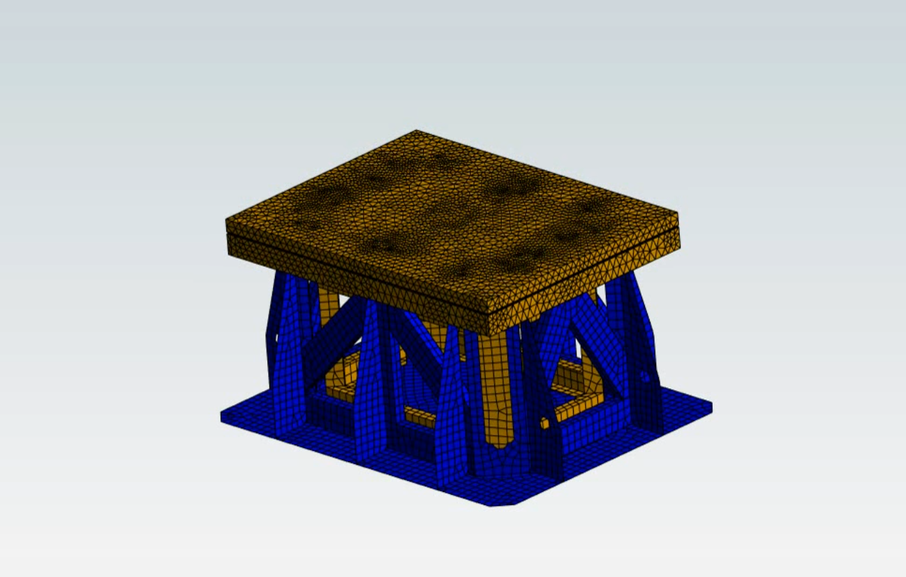
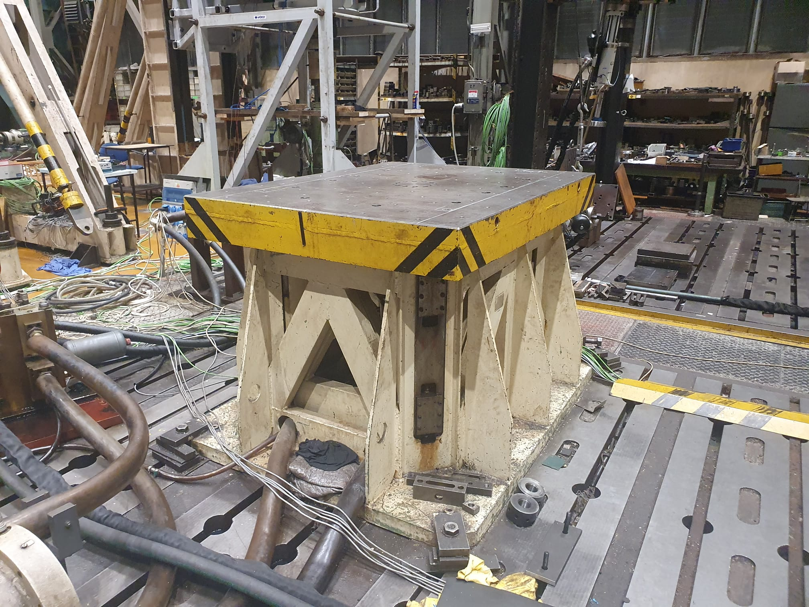

# modal-harmonic-response-vibration-table-unit
A preview of results from an ANSYS project regarding modal analysis and harmonic response of a testing vibration table unit.

## Description
This is a preview of my ANSYS project devoted to modal analysis and harmonic response of a testing vibration table unit.
The unit is inspired by a real testing table in a real dynamic testing facility (see images).

Key features:
- Full CAD model of the testing table, available in /src in .prt form
- Full CAD model of the testing table, available in /src in .scdoc form
- Modal analysis using an FEM software (ANSYS)
- Usage of combined element types (shell/space)
- Dynamic response of the system to harmonic force input, corresponding to real scenarios

## Preview

*An example of free oscilation (0 Hz):* (click on thumbnail for YT video) 

*An example of the second mode shape (94 Hz)* (click on thumbnail for YT video) 

*An example of the third mode shape (137 Hz)* (click on thumbnail for YT video) 

*An example of the sixth mode shape (144 Hz)* (click on thumbnail for YT video) 

*An example of the sixteenth mode shape (261 Hz)* (click on thumbnail for YT video) 

*An example of the system response to the 
